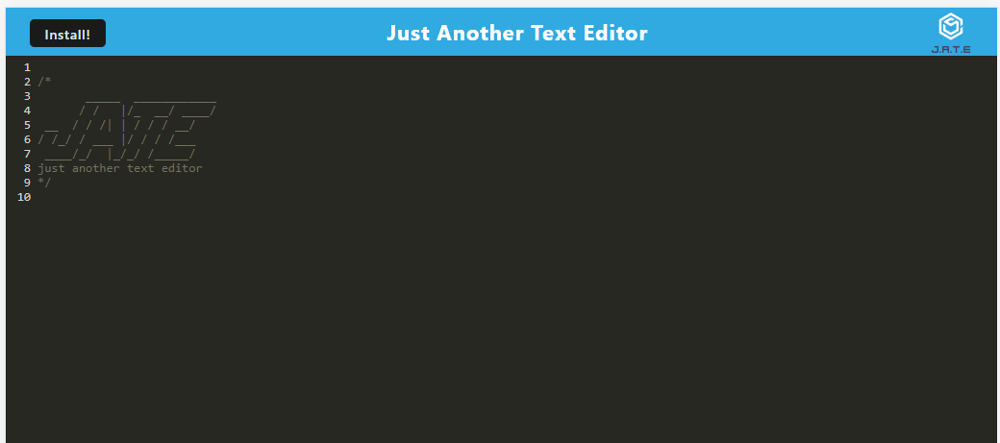

## ELL PWA

## Description

I wanted to take what I have learned about PWA's and create this PWA app for users to use to create notes of their liking.

## Installation

npm i;
npm start

## Usage

The test [website](https://thawing-fortress-54758.herokuapp.com/) allows you to view the test README used for submission 

You can look through the files to check out my notes PWA app!

## License

Please refer to the LICENSE in the repo.

## Credits

Class assignments and lessons related to this module were used when building this project, along with outside resources such as:
-W3Schools
-Mozilla
-ChatGPT (great at explaining errors!)

## Questions

Please feel free to reach out with any questions by email or connect through [LinkedIn](https://www.linkedin.com/in/elizabeth-lopez-lopez-345b3b14a/)
